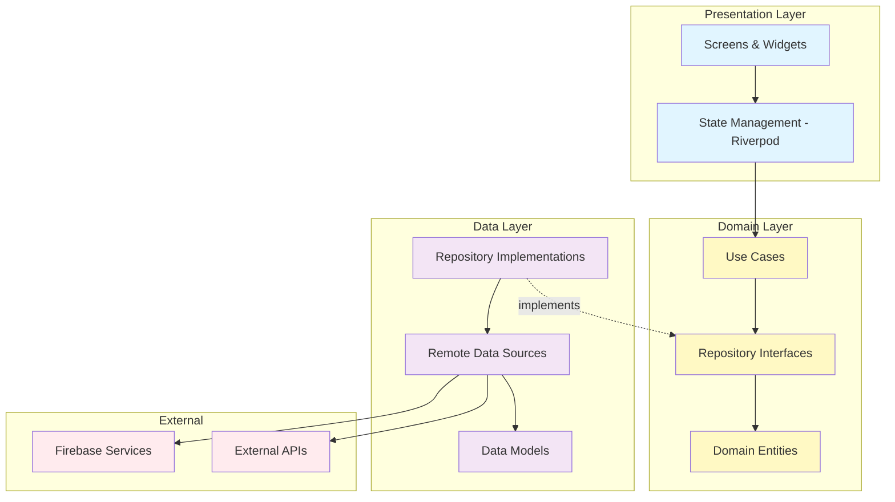
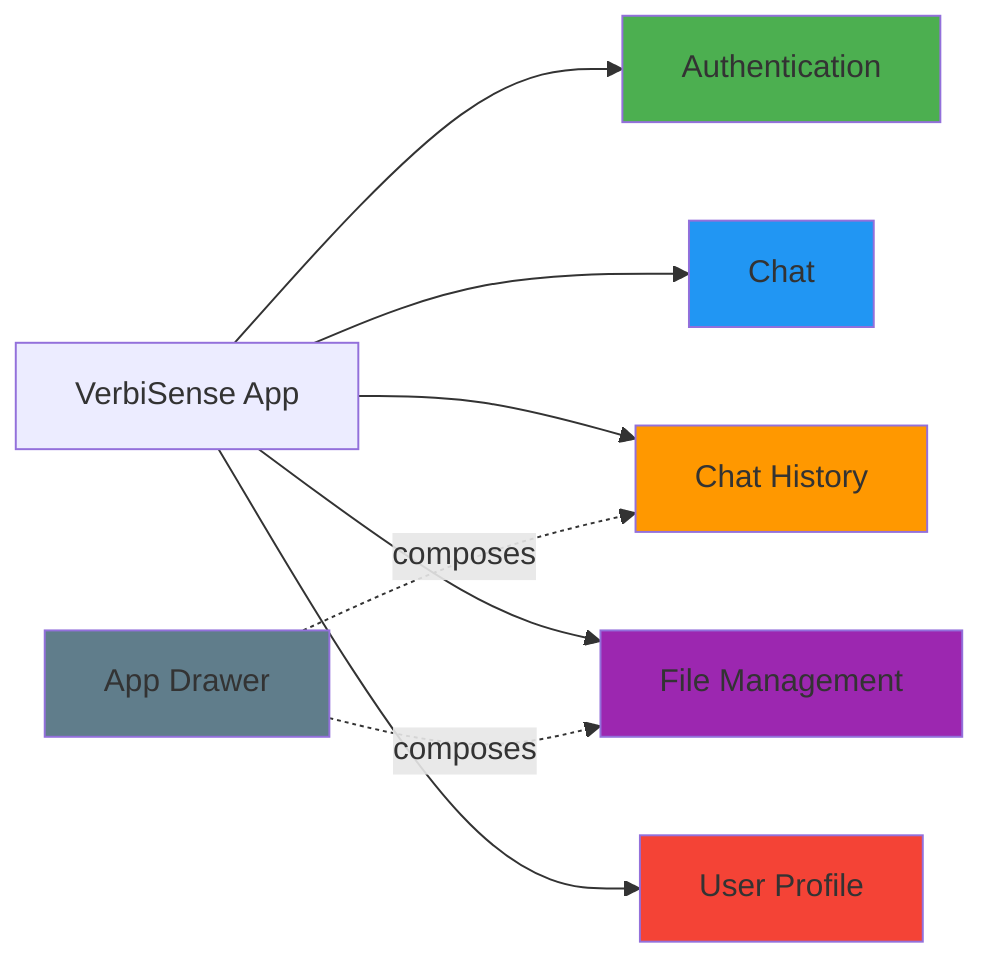
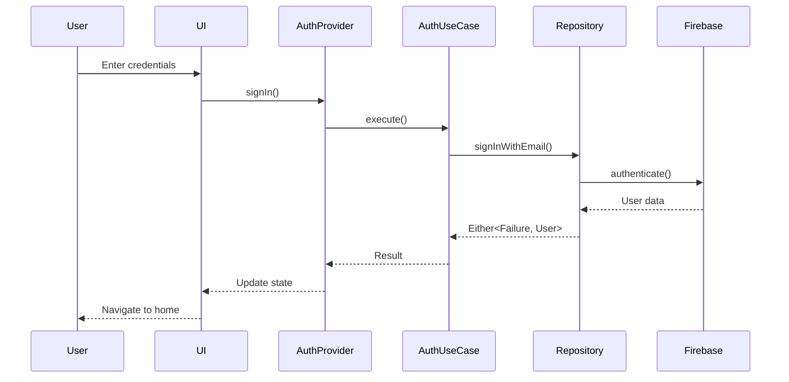

# VerbiSense

> An intelligent AI-powered chat application built with Flutter and Firebase, featuring document analysis and conversational AI capabilities.

[](https://flutter.dev)
[](https://firebase.google.com)
[](https://blog.cleancoder.com/uncle-bob/2012/08/13/the-clean-architecture.html)

---

## Table of Contents

- [Overview](#overview)
- [Features](#features)
- [Architecture](#architecture)
- [Tech Stack](#tech-stack)
- [Project Structure](#project-structure)
- [Getting Started](#getting-started)
- [Configuration](#configuration)
- [Features Deep Dive](#features-deep-dive)
- [Contributing](#contributing)

---

## Overview

VerbiSense is a modern Flutter application that combines AI-powered conversational capabilities with document management. Built using **Clean Architecture** principles, the app is organized by business capabilities, ensuring scalability, maintainability, and testability.

### Key Highlights

- **Clean Architecture** - Organized by business capabilities, not UI screens
- **Firebase Integration** - Authentication, Firestore, Storage, Cloud Functions
- **Modern UI/UX** - Material Design with custom theming
- **Document Management** - Upload, view, and manage documents (up to 3MB)
- **AI Chat** - Conversational AI with context-aware responses
- **Chat History** - Persistent conversation history with Firebase
- **Multi-Auth** - Email/Password and Google Sign-In
- **Push Notifications** - Firebase Cloud Messaging integration

---

## Features

### Authentication

- Email and password authentication
- Google Sign-In integration
- Secure session management
- Password change functionality

### Chat

- AI-powered conversational interface
- Real-time message synchronization
- Context-aware responses
- Structured response formatting (headings, key takeaways, examples)

### File Management

- Upload documents (PDF, images, etc.)
- Maximum 3 files, 3MB each
- View uploaded documents
- Delete files with confirmation
- Firebase Storage integration

### Chat History

- Persistent conversation history
- Quick access to recent chats
- Date-based organization
- Navigate to previous conversations

### User Profile

- Update display name
- Change password
- View authentication provider info
- Google account integration

---

## Architecture

This project follows **Clean Architecture** principles, organized by **business capabilities** rather than UI screens.

### Architecture Diagram



### Feature-Based Organization



### Dependency Flow

```makrdown
presentation → domain ← data → external
```

- **Presentation** depends on **Domain**
- **Data** depends on **Domain**
- **Domain** depends on nothing (pure business logic)
- **External** services are abstracted by **Data** layer

---

## Tech Stack

### Core

- **Flutter** 3.9.2 - Cross-platform UI framework
- **Dart** - Programming language

### State Management

- **Riverpod** 3.0.0 - Reactive state management
- **fpdart** 1.1.1 - Functional programming utilities

### Backend & Services

- **Firebase Core** - Firebase initialization
- **Firebase Auth** - User authentication
- **Cloud Firestore** - NoSQL database
- **Firebase Storage** - File storage
- **Cloud Functions** - Serverless functions
- **Firebase Messaging** - Push notifications
- **Firebase Analytics** - App analytics

### Authentication Libraries

- **Google Sign-In** 7.1.1 - OAuth integration

### Dependency Injection

- **GetIt** 8.2.0 - Service locator

### Routing

- **GoRouter** 16.2.1 - Declarative routing

### UI/UX

- **Flutter SVG** - SVG rendering
- **Shimmer** - Loading animations
- **Pigment** - Color utilities

### Utilities

- **File Picker** - Document selection
- **URL Launcher** - External link handling
- **Shared Preferences** - Local storage
- **Logger** - Logging utility
- **HTTP** - API requests

---

## Project Structure

```markdown
lib/
├── core/                           # Shared code across features
│   ├── config/                     # App configuration
│   ├── constants/                  # App constants
│   ├── data/                       # Core data sources
│   ├── domain/                     # Core use cases
│   ├── entities/                   # Shared entities
│   ├── error/                      # Error handling
│   ├── providers/                  # Core providers
│   ├── resources/                  # Strings, colors, assets
│   ├── router/                     # App routing
│   ├── themes/                     # App theming
│   ├── utils/                      # Utility functions
│   └── widgets/                    # Shared widgets
│
├── features/                       # Feature modules
│   ├── authentication/             # User authentication
│   │   ├── data/
│   │   │   ├── datasources/
│   │   │   ├── models/
│   │   │   └── repositories/
│   │   ├── domain/
│   │   │   ├── repository/
│   │   │   └── usecases/
│   │   └── presentation/
│   │       ├── providers/
│   │       ├── screens/
│   │       └── widgets/
│   │
│   ├── chat/                       # AI chat functionality
│   │   ├── data/
│   │   │   ├── datasources/
│   │   │   ├── models/
│   │   │   └── repositories/
│   │   ├── domain/
│   │   │   ├── repository/
│   │   │   └── usecases/
│   │   └── presentation/
│   │       ├── providers/
│   │       ├── screens/
│   │       └── widgets/
│   │
│   ├── chat_history/               # Chat history management
│   │   ├── data/
│   │   ├── domain/
│   │   └── presentation/
│   │
│   ├── file_management/            # Document upload/management
│   │   ├── data/
│   │   ├── domain/
│   │   └── presentation/
│   │
│   ├── account/                    # User profile management
│   │   ├── data/
│   │   ├── domain/
│   │   └── presentation/
│   │
│   └── about_us/                   # About screen
│       └── presentation/
│
├── firebase_options.dart           # Firebase configuration
├── init_dependencies.dart          # Dependency injection setup
└── main.dart                       # App entry point
```

### Feature Module Structure

Each feature follows the same clean architecture pattern:

```markdown
feature_name/
├── data/                   # Data layer
│   ├── datasources/        # Remote/Local data sources
│   ├── models/             # Data models (JSON serialization)
│   └── repositories/       # Repository implementations
├── domain/                 # Domain layer (business logic)
│   ├── repository/         # Repository interfaces
│   └── usecases/           # Business use cases
└── presentation/           # Presentation layer
    ├── providers/          # State management
    ├── screens/            # UI screens
    └── widgets/            # Feature-specific widgets
```

---

## Getting Started

### Prerequisites

- Flutter SDK (3.9.2 or higher)
- Dart SDK (included with Flutter)
- Firebase account
- Android Studio / VS Code
- Git

### Installation

1. **Clone the repository**

   ```bash
   git clone https://github.com/yourusername/verbisense.git
   cd verbisense
   ```

2. **Install dependencies**

   ```bash
   flutter pub get
   ```

3. **Set up Firebase**
   - Create a new Firebase project at [Firebase Console](https://console.firebase.google.com)
   - Add Android and iOS apps to your Firebase project
   - Download `google-services.json` (Android) and `GoogleService-Info.plist` (iOS)
   - Place them in the appropriate directories:
     - Android: `android/app/google-services.json`
     - iOS: `ios/Runner/GoogleService-Info.plist`

4. **Configure Firebase services**
   - Enable Authentication (Email/Password and Google Sign-In)
   - Create Firestore database
   - Set up Firebase Storage
   - Enable Cloud Functions (if using)
   - Configure Firebase Cloud Messaging

5. **Create environment file**

   ```bash
   # Create .env file in the root directory
   touch .env
   ```

   Add your environment variables:

   ```env
   # Add your API keys and configuration here
   API_KEY=your_api_key_here
   ```

6. **Run the app**

   ```bash
   flutter run
   ```

### Build for Production

**Android:**

```bash
flutter build apk --release
# or
flutter build appbundle --release
```

**iOS:**

```bash
flutter build ios --release
```

---

## Configuration

### Firebase Setup

1. **Firestore Security Rules**

   ```javascript
   rules_version = '2';
   service cloud.firestore {
     match /databases/{database}/documents {
       match /users/{userId} {
         allow read, write: if request.auth != null && request.auth.uid == userId;
         
         match /chats/{chatId} {
           allow read, write: if request.auth != null && request.auth.uid == userId;
         }
       }
     }
   }
   ```

2. **Storage Security Rules**

   ```javascript
   rules_version = '2';
   service firebase.storage {
     match /b/{bucket}/o {
       match /uploads/{userId}/{fileName} {
         allow read, write: if request.auth != null && request.auth.uid == userId;
       }
     }
   }
   ```

### Environment Variables

Create a `.env` file in the root directory:

```env
# API Configuration
API_BASE_URL=https://your-api-url.com
API_KEY=your_api_key

# Feature Flags
ENABLE_ANALYTICS=true
```

---

## Features Deep Dive

### Authentication Flow



### File Upload Process

1. User selects files using File Picker
2. Validation (max 3 files, 3MB each)
3. Upload to Firebase Storage under `uploads/{userId}/`
4. Store file URLs in Firestore
5. Update UI with uploaded files

### Chat Message Flow

1. User sends message
2. Message saved to Firestore
3. API call to AI service
4. Response parsed and structured
5. Response saved to Firestore
6. UI updated with new message

---

## Testing

```bash
# Run all tests
flutter test

# Run tests with coverage
flutter test --coverage

# Run specific test file
flutter test test/features/authentication/domain/usecases/email_signin_test.dart
```

---

## Screenshots

> Add screenshots of your app here

---

## Contributing

Contributions are welcome! Please follow these steps:

1. Fork the repository
2. Create a feature branch (`git checkout -b feature/amazing-feature`)
3. Commit your changes (`git commit -m 'Add amazing feature'`)
4. Push to the branch (`git push origin feature/amazing-feature`)
5. Open a Pull Request

### Code Style

- Follow [Effective Dart](https://dart.dev/guides/language/effective-dart) guidelines
- Use meaningful variable and function names
- Add comments for complex logic
- Maintain clean architecture principles

---

## License

This project is licensed under the MIT License - see the [LICENSE](LICENSE) file for details.

---

## Author

### Jagadeeswaran M

- GitHub: [@JagadeeswaranM](https://github.com/Jagadeeswaran27)
- LinkedIn: [JagadeeswaranM](https://www.linkedin.com/in/jagadeeswaran-m-59a269287)

---

## Acknowledgments

- [Flutter](https://flutter.dev) - UI framework
- [Firebase](https://firebase.google.com) - Backend services
- [Riverpod](https://riverpod.dev) - State management
- [Clean Architecture](https://blog.cleancoder.com/uncle-bob/2012/08/13/the-clean-architecture.html) - Architecture pattern
